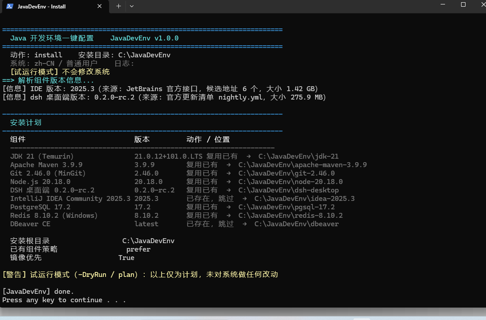
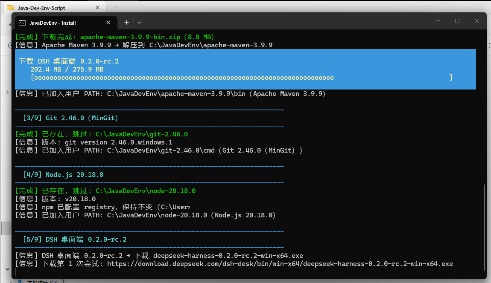
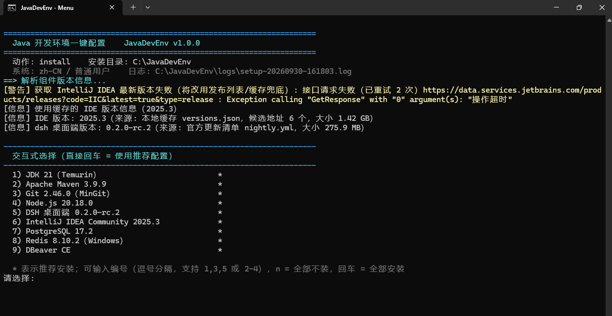
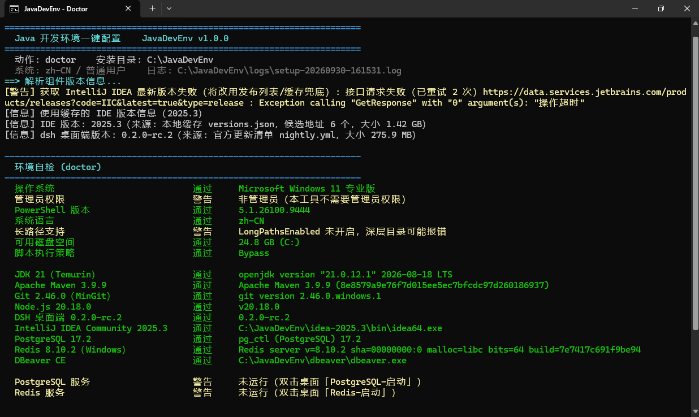
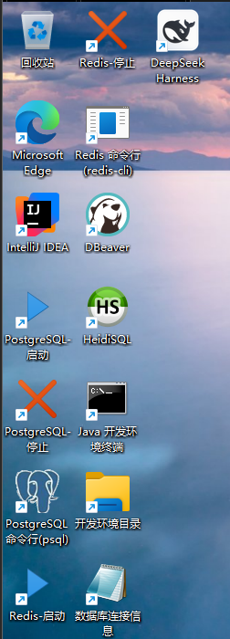
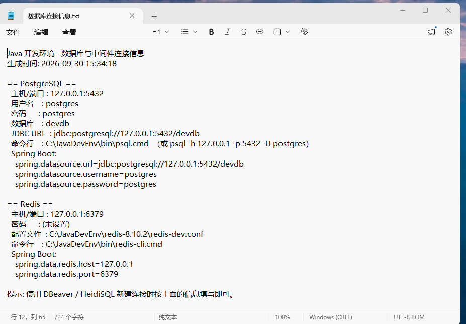

# Windows Java 开发环境一键配置（JavaDevEnv）

[](LICENSE)


[](CONTRIBUTING.md)

[](https://github.com/italycalibur2019/Java-Dev-Env-Script/actions/workflows/verify.yml)

一套面向 Windows 的 PowerShell 脚本，用于在新机器上**快速搭好 Java 开发环境**：
JDK、Maven、Git、Node.js、DSH（DeepSeek Harness 桌面端）、IntelliJ IDEA、PostgreSQL、Redis、DBeaver、HeidiSQL，
以及 SSH 终端 **WindTerm**、API 测试 **Apifox**、Redis 可视化 **Tiny RDM**
全部**绿色免安装**（解压即用；DSH 桌面端是官方安装包，会静默装到安装目录内），
自动写入用户级环境变量、生成桌面快捷方式、初始化数据库，并把连接信息整理成可直接粘贴到 Spring Boot 配置里的文件。
PostgreSQL / Redis 默认随登录自动启动（无需管理员），桌面启停快捷方式使用专门合成的「logo + 启停角标」图标。

- 适用系统：Windows 10 / 11 / Server 2019+（已在 Windows 11 + Windows PowerShell 5.1 实测）
- 无需管理员权限（默认流程全部写入当前用户，不碰系统目录与 HKLM）
- 脚本会自动**探测并复用**机器上已有的组件，不会盲目重复下载
- 所有版本、镜像、端口、密码、快捷方式都可通过 JSON 配置定制



*`install.cmd -DryRun`：动手前先看清每个组件解析到的版本、是「复用已有」还是「安装」、以及装到哪个目录。*

---

## 一、快速开始

1. 把整个目录拷贝到目标机器（例如 `D:\Tools\Java-Dev-Env-Script`）。
2. 双击 **`install.cmd`**（推荐），或在该目录打开终端执行：

```bat
install.cmd
```

脚本会自动完成：解析版本 → 下载（缺什么下什么）→ 解压到安装目录 → 写环境变量 →
生成桌面快捷方式 → 初始化并启动数据库 → 输出安装报告。



*安装过程：多镜像下载（带进度与断点续传）、逐组件解压、写入用户级 PATH。*

安装完成后**新开一个终端**验证：

```bat
java -version
mvn -v
psql --version
redis-cli ping
```

DSH 桌面端不用命令行验证：双击桌面的 **DSH 桌面端** 图标即可（若安装包自己已经建了
「DeepSeek Harness」快捷方式，脚本不会重复创建）。

> 想先看看会做什么，而不做任何改动：`install.cmd -DryRun`
> 想自己挑组件：`menu.cmd`（交互式）或 `install.cmd -Components jdk,maven,git`

### 界面预览



*`menu.cmd`：交互式挑选组件（`*` 为推荐项，也可用 `-Components` 直接指定）。*



*`doctor.cmd`：逐项自检给出通过/警告，出问题时先跑它。*



*桌面快捷方式：数据库启停、命令行、开发环境终端、安装目录、连接信息。*



*生成的「数据库连接信息.txt」：JDBC URL、账号密码、Spring Boot 配置片段可直接粘贴。*

### 命令入口

| 文件 | 作用 |
| --- | --- |
| `install.cmd` | 一键安装（默认按 `standard` 组合全自动执行） |
| `menu.cmd` | 交互式向导，逐个选择要安装的组件 |
| `status.cmd` | 查看当前环境状态（装了什么、在哪、环境变量是否就绪） |
| `doctor.cmd` | 环境自检（版本可执行、数据库连通性、端口占用、开机自启、长路径等） |
| `uninstall.cmd` | 卸载 / 回滚（默认保留数据库数据目录） |

---

## 二、目录结构

```
Java-Dev-Env-Script\
├─ install.cmd / menu.cmd / status.cmd / doctor.cmd / uninstall.cmd   入口（纯 ASCII，UTF-8 控制台）
├─ Setup-JavaDevEnv.ps1            主脚本（参数解析、流程调度）
├─ lib\
│   ├─ 00-Common.ps1               日志、配置、下载（断点续传）、解压、用户环境变量、快捷方式
│   ├─ 10-Catalog.ps1              组件目录、版本解析、已有安装探测、安装引擎
│   ├─ 20-Configure.ps1            各组件的初始化配置（Maven/IDEA/PG/Redis/npm/便携模式）
│   └─ 30-Actions.ps1              install / status / doctor / uninstall / 报告
├─ config\
│   ├─ default.json                全部默认配置（版本、镜像、端口、密码、开关）
│   └─ user.example.json           定制示例：复制为 user.json 即生效
├─ tools\Verify-Repo.ps1           提交前自检（BOM / 编码 / 语法 / JSON / 敏感信息）
├─ assets\icons\                   数据库启停快捷方式图标（合成成品 + src 素材与生成脚本）
├─ docs\images\                    README 用的截图（需要哪些图见该目录下的 README.md）
├─ .github\workflows\verify.yml    CI：在 PowerShell 5.1 与 7 下各跑一遍自检
├─ .github\ISSUE_TEMPLATE\         问题反馈 / 功能建议模板（会要求你贴 doctor 输出）
├─ .gitattributes                  禁止 Git 转换行尾与编码（BOM 必须原样保留）
├─ .gitignore                      忽略 config\user.json（可能含密码）与运行产物
├─ CONTRIBUTING.md                 贡献指南：编码铁律、PowerShell 踩坑清单、加组件步骤
├─ CHANGELOG.md / LICENSE / README.md
```

安装后的目录（默认 `D:\JavaDevEnv`）：

```
D:\JavaDevEnv\
├─ jdk-21\  apache-maven-3.9.9\  git-2.46.0\  node-20.18.0\  node-global\
├─ idea-2025.3\  dbeaver\  heidisql-12.8\  pgsql-17.2\  redis-8.10.2\  dsh-desktop\
├─ windterm-2.7.0\  apifox\  tinyrdm-1.2.7\          SSH 终端 / API 测试 / Redis 可视化
├─ bin\         pg-start.cmd / pg-stop.cmd / psql.cmd / redis-start.cmd / redis-tray.ps1 / devshell.cmd / dsh-cli.cmd ...
├─ icons\       启停快捷方式用的 .ico（安装时从仓库 assets\icons 复制）
├─ data\        postgres\  redis\  dbeaver-workspace\
├─ cache\       下载的压缩包（可删，下次重装复用）
├─ config\      生成的 maven-settings.xml / npmrc 参考副本
├─ logs\        setup-*.log、postgres.log、redis.log、install-report-*.md、env-backup-*.json
├─ env.cmd / env.ps1            仅对当前窗口生效的环境脚本
└─ 数据库连接信息.txt            主机/端口/账号/JDBC/Spring Boot 配置
```

> `dsh-desktop\` 只在“脚本自己安装 DSH 桌面端”时出现；如果复用了你已有的安装（例如 `D:\Software\DSH`），
> 目录里不会有它，一切以 `status.cmd` 显示的实际位置为准。

---

## 三、命令参数

```powershell
# 常用
install.cmd                                  # 一键安装（无人值守）
install.cmd -Interactive                     # 交互式选择组件
install.cmd -Components jdk,maven,git        # 只装指定组件（自动补齐依赖）
install.cmd -Profile minimal|standard|full   # 组合
install.cmd -Root E:\JavaDevEnv              # 指定安装目录
install.cmd -DryRun                          # 只打印计划
install.cmd -Force                           # 强制重新下载安装（忽略“已存在/复用”）
install.cmd -Offline                         # 只用本地缓存，不联网
install.cmd -NoEnv                           # 不改环境变量（仅解压+配置）
install.cmd -NoShortcuts                     # 不建快捷方式
install.cmd -Autostart                       # 本次安装把 PostgreSQL/Redis/DSH 的自启全部打开
install.cmd -LogLevel Debug                  # 详细日志

# 运维
status.cmd
doctor.cmd
install.cmd -Action autostart                # 只应用自启配置（改完 user.json 后用，无需重装）
uninstall.cmd                                # 卸载（保留 data 数据）
uninstall.cmd -BackupFile <env-backup.json>  # 同时回滚环境变量
install.cmd -Action help                     # 查看完整帮助
```

组件 key：`jdk` `maven` `ide` `git` `node` `dsh` `dsh-cli` `postgres` `redis` `dbeaver` `heidisql` `windterm` `apifox` `tinyrdm`

> `-Components` 也接受**分组名**：写 `jdk` 会选中所有已配置的 JDK 版本（如 `jdk21`、`jdk17`），
> 写 `database` 会选中 `postgres` + `redis`。组件间依赖会自动补齐（例如 `dsh-cli` 会带上 `node`）。

---

## 四、组件与“免安装”实现方式

| 组件 | 默认版本/来源 | 免安装方式 |
| --- | --- | --- |
| JDK | Temurin（Adoptium API 取最新 GA，默认 21，可多版本） | zip 解压；`JAVA_HOME`、`JAVA_HOME_21`、PATH |
| Maven | 3.9.9（华为云/dlxcdn/archive/apache 多镜像回退） | zip 解压；`MAVEN_HOME`、PATH、生成 `settings.xml` |
| Git | MinGit 2.46.0 | zip 解压；`cmd\` 加入 PATH |
| Node.js | 20.18.0（nodejs.org / npmmirror） | zip 解压；npm 源可切镜像 |
| dsh | **DSH 桌面端**：官方 `deepseek-harness-<版本>-win-x64.exe`，版本从官方更新清单 `nightly.yml` 解析 | 静默安装（`/S /currentuser /D=<root>\dsh-desktop`），装完直接可用，无需 Node/Python |
| dsh-cli | `@deepseek-ai/dsh`（npm 全局包，**默认关闭**） | `npm install -g --prefix <root>\node-global`，并生成带 profile 提示的启动器 |
| IntelliJ IDEA | JetBrains 官方 `windowsZip`（默认 IC 2025.3，API 动态取最新） | zip 解压 + **便携模式**（配置/插件/缓存写在安装目录 `portable\`） |
| PostgreSQL | 17.2 EDB 免安装二进制 | zip 解压 + `initdb` 本地实例，脚本启停（可选开机自启） |
| Redis | 8.10.2（redis-windows，含 Service 支持） | zip 解压 + 自带 conf，脚本启停 |
| DBeaver CE | 官方 zip（latest 直链） | zip 解压，工作区指向 `data\dbeaver-workspace` |
| HeidiSQL | 12.8 便携版（**默认关闭**） | zip 解压 + 生成 `portable_settings.txt` |
| WindTerm | 2.7.0（GitHub Release 实时解析最新） | 便携 zip 解压即用（SSH/SFTP 终端；首次启动选一次 profiles 目录） |
| Apifox | 官方固定 latest 链接（`Apifox-windows-latest.zip`） | 官方 zip 里是 NSIS 安装器：解壳后 `/S /currentuser /D=` 静默装进安装目录 |
| Tiny RDM | 1.2.7（GitHub Release 实时解析最新） | 便携 zip 解压即用（轻量 Redis 可视化） |
| 自定义 | `config` 里的 `components.extras` | 任意 zip + 指定 exe/快捷方式/PATH |

> **数据库管理工具二选一**：`dbeaver`（默认，跨库、功能全）与 `heidisql`（约 28MB、原生启动快）定位相同，
> 默认只装 **DBeaver**，HeidiSQL 默认 `enabled: false` 不会下载。想改用轻量的 HeidiSQL：
> ```json
> "components": {
>   "dbeaver":  { "enabled": false },
>   "heidisql": { "enabled": true }
> }
> ```
> 组件是否安装由 `components.<name>.enabled` 决定；`-Profile full` 表示“所有 **enabled=true** 的组件”。

> **DSH（DeepSeek Harness）默认装桌面端**：官方已经有桌面客户端，脚本默认使用它，
> 版本号从官方更新清单（`https://download.deepseek.com/dsh-desk/feeds/win-x64/nightly.yml`）解析，取不到才用
> `fallbackVersion`。已装过的话（含你自己手动装的）会被自动探测复用，不会重复下载 276MB。
>
> 两点要知道：
> 1. 桌面端是**官方安装包（NSIS）**，不是绿色版：它会在“添加/删除程序”里登记、并自带卸载程序，
>    脚本只是用 `/S /currentuser /D=<root>\dsh-desktop` 静默装到安装目录里。
>    （NSIS 的 `/D=` 不保证被采纳，所以装完会再按注册表登记的实际位置找一遍。）
> 2. 想要终端里的 `dsh web` / `dsh tui` / `dsh headless "任务"`，把 `dsh-cli` 打开：
>    ```json
>    "components": { "dsh-cli": { "enabled": true } }
>    ```
>    两个版本共用同一个 `~/.dsh` 数据目录，会话与配置互通，可以同时用。
>    `dsh-cli` 的快捷方式不是直接指向 `dsh.cmd` —— 因为 `dsh` **必须带 profile 名**启动
>    （直接双击 `dsh.cmd` 会立刻以 `error: --profile <name> is required` 退出、窗口一闪而过），
>    脚本生成的 `<root>\bin\dsh-cli.cmd` 会先给提示、默认进 `web`，并用 `cmd /k` 让窗口留在原地。

### 数据库说明

- **PostgreSQL**：脚本用免安装二进制自建一个**独立实例**，数据目录在 `<root>\data\postgres`，
  默认端口 `5432`、超级用户 `postgres`、密码 `postgres`、自动创建 `devdb` 数据库。
  启停方式（桌面快捷方式同名）：
  ```bat
  <root>\bin\pg-start.cmd     <root>\bin\pg-stop.cmd     <root>\bin\pg-status.cmd
  <root>\bin\psql.cmd         :: 已内置 PGPASSWORD，直接进 psql
  ```
- **Redis**：配置文件 `<root>\redis-8.10.2\redis-dev.conf`（端口/密码/内存上限由配置生成），
  ```bat
  <root>\bin\redis-start.cmd   <root>\bin\redis-stop.cmd   <root>\bin\redis-cli.cmd
  ```
  Redis 以**无窗口方式后台运行**：任务栏不会再出现命令提示符窗口，取而代之的是通知区域（托盘）里的
  一个小图标——双击打开日志，右键菜单可以**重启 / 停止 / 退出托盘（保持 Redis 运行）**。
  该托盘是脚本生成的原生 PowerShell 程序（`<root>\bin\redis-tray.ps1`），不依赖任何第三方软件。
- **开机自启（默认已开启）**：`postgres` / `redis` 默认 `autostart: true`，登录后自动拉起
  （全程隐藏窗口，无黑框；Redis 登录后托盘图标直接就位）；
  `dsh`（DSH 桌面端）默认不跟随登录，想开机就启动它就在配置里把 `components.dsh.autostart` 设为 `true`。
  全程走「启动」文件夹，**无需管理员、无需注册 Windows 服务**；把开关改成 `false` 后重跑
  `install.cmd -Action autostart` 即可移除对应自启项，卸载时也会自动清理。
- **机器上已经有 PostgreSQL / Redis 怎么办？**
  脚本会扫描各磁盘的常见目录（`X:\Database`、`X:\Dev`、`X:\Java`、`X:\Software`、`X:\Tools` …）和注册表，
  找到已安装的实例后，`existingPolicy=prefer`（默认）下会**直接复用**：
  **不会**再造第二个实例，也**不会**往已有安装目录里写任何文件，只在
  `<root>\数据库连接信息.txt` 里写明连接方式和安装位置。
  想额外建一个隔离的开发实例时：
  ```json
  "components": {
    "postgres": { "createInstance": true, "port": 5433 },
    "redis":    { "createInstance": true, "port": 6380 }
  }
  ```
  `createInstance`：`auto`（默认，复用已有安装时不建实例）/ `true`（总是创建）/ `false`（从不创建）。
- **端口自动顺延**：创建实例时若配置的端口已被占用（例如机器上已有 PostgreSQL 在监听 5432），
  脚本会自动改用其后的空闲端口（最多往后找 20 个），并把**实际端口**记录到安装标记，
  之后生成的启动脚本、快捷方式、`doctor` 检查和连接信息都以该端口为准，重跑脚本也会沿用同一端口。
- **管理员终端下 PostgreSQL 不会自启动**：PostgreSQL 官方限制「不允许以管理员（提升权限）身份运行服务端」。
  如果你用管理员终端跑脚本，安装与 `initdb` 初始化都会正常完成，但脚本会**跳过启动**并给出提示；
  此时双击桌面上的「PostgreSQL-启动」即可（从资源管理器启动的进程是普通权限）。
  Redis 没有这个限制。`doctor.cmd` 也会提示这一点。
- 需要真正的 Windows 服务时：Redis 用的是 `-with-Service` 版本，可执行
  `redis-server.exe --service-install redis-dev.conf --service-name RedisDev`（需管理员）；
  PostgreSQL 建议用 EDB 官方安装器注册服务，本脚本专注于免管理员的绿色实例。

### 启停快捷方式图标

桌面上的「PostgreSQL-启动 / 停止」「Redis-启动 / 停止」不用系统通用图标，而是专门合成的样式：
以 PostgreSQL 大象、Redis 方块 logo 为主体，右下角叠加 Windows 风格的启动（绿色播放）/ 停止（红色方块）角标，
一眼可分；同一个 .ico 内置 16–256 全尺寸，任务栏和资源管理器里都清晰。
图标成品在仓库 `assets\icons\`（素材与生成脚本在 `assets\icons\src\`）：


---

## 五、定制化

把 `config\user.example.json` 复制成 **`config\user.json`**，只写要覆盖的字段即可（深度合并）：

```json
{
  "installRoot": "E:\\JavaDevEnv",
  "existingPolicy": "prefer",
  "preferMirrors": true,
  "components": {
    "jdk":      { "versions": [21, 17], "default": 21 },
    "maven":    { "version": "3.9.9", "settings": { "mirror": "aliyun", "localRepository": "portable" } },
    "ide":      { "edition": "IU", "version": "2025.3", "portable": true, "vmOptionsHeap": "4096m" },
    "postgres": { "port": 5433, "password": "dev123456", "databases": ["devdb", "testdb"], "autostart": true,
                  "localeProvider": "icu", "icuLocale": "zh-CN" },
    "redis":    { "port": 6380, "password": "redis123", "maxmemory": "1gb" },
    "dsh":      { "enabled": true, "autostart": false },
    "dsh-cli":  { "enabled": false, "registry": "https://registry.npmmirror.com" },
    "windterm": { "enabled": true },
    "apifox":   { "enabled": true },
    "tinyrdm":  { "enabled": true }
  },
  "shortcuts": { "items": ["ide", "dbeaver", "pg", "redis", "devshell", "root", "dsh", "dsh-cli", "dbinfo", "windterm", "apifox", "tinyrdm"] }
}
```

常用字段：

| 字段 | 说明 |
| --- | --- |
| `installRoot` / `installRootFallback` | 安装根目录；首选盘不可用/空间不足时自动回退 |
| `profile` / `profiles` | `minimal`(jdk+maven+git) / `standard` / `full`，也可自定义 |
| `existingPolicy` | `prefer`＝优先复用机器上已装好的组件；`ignore`＝一律装到安装目录 |
| `preferMirrors` | `auto`（中文系统优先国内镜像）/ `true` / `false` |
| `download.proxy` | 走代理下载，例如 `http://127.0.0.1:7890` |
| `download.retries` | 单个地址重试次数（失败会自动换下一个镜像，最后用 BITS 兜底） |
| `env.setUserEnvVars` / `updateUserPath` | 是否写用户环境变量 / 追加 PATH |
| `env.forceJavaHome` | 机器上已有 JDK 时，是否仍把 `JAVA_HOME` 指向本工具安装的 JDK |
| `env.mavenOpts` | 默认 `-Dfile.encoding=UTF-8`（中文 Windows 编译乱码的常见解药） |
| `shortcuts.items` | 生成哪些快捷方式：`ide` `dbeaver` `heidisql` `pg` `redis` `devshell` `root` `dsh` `dsh-cli` `dbinfo` `windterm` `apifox` `tinyrdm` |
| `components.<x>.enabled` | 是否安装该组件 |
| `uninstall.*` | 卸载时是否删文件/环境变量/快捷方式，是否保留 `data` |

### 增加自定义软件（extras）

```json
"extras": [
  {
    "key": "vscode", "name": "VS Code", "enabled": true,
    "url": "https://update.code.visualstudio.com/latest/win32-x64-archive/stable",
    "fileName": "vscode-win32-x64.zip",
    "dirName": "VSCode", "exe": "Code.exe",
    "pathEntries": ["bin"], "addToPath": true,
    "shortcuts": [ { "name": "VS Code", "target": "Code.exe" } ]
  }
]
```

---

## 六、环境变量与回滚

- 只修改**当前用户**（`HKCU\Environment`），不涉及系统变量，不需要管理员。
- 每次安装前会把 `Path`、`JAVA_HOME`、`MAVEN_HOME`、`MAVEN_OPTS` 等备份到
  `<root>\logs\env-backup-<时间>.json`；需要回滚时：
  ```bat
  install.cmd -Action restore -BackupFile "D:\JavaDevEnv\logs\env-backup-20260930-120000.json"
  ```
- 只对当前窗口生效（不改注册表）：
  ```bat
  D:\JavaDevEnv\env.cmd
  ```
  ```powershell
  . D:\JavaDevEnv\env.ps1
  ```
- 环境变量写完后脚本会广播 `WM_SETTINGCHANGE`；**已打开的终端不会自动刷新**，请新开窗口。

### 关于已有环境

默认 `existingPolicy = "prefer"`：如果机器上已经装好 Maven/Git/JDK 等，脚本会**直接复用**
（安装计划里显示“复用已有”），只补缺的东西。若希望全部装到自己的目录：

```bat
install.cmd -Force
```

JDK 复用时要求主版本一致（例如配置 21，机器上是 25 → 会另装一个 21）。
如果已有 `JAVA_HOME` 而本工具装了新 JDK，默认会提示并保留原值；
想强制切换为脚本安装的 JDK，把 `env.forceJavaHome` 设为 `true`。

---

## 七、常见问题

**1. 下载很慢或失败？**
换镜像：`config\user.json` 里设 `"preferMirrors": true`；或指定代理 `"download.proxy"`。
脚本按「镜像 → 官方 → BITS」顺序自动重试，已下载的压缩包会缓存在 `<root>\cache`，
重跑只补缺的部分。

**1.1 版本解析失败（GitHub / JetBrains 接口偶尔 403 或超时）？**
JDK、IDEA、Redis 的“最新版本”来自官方接口，脚本按下面顺序层层兜底，正常不会中断安装：

1. 官方接口（带 2 次重试，空响应也会重试）；
2. IDEA 专用：改用**官方发布列表**取最新的、链接可用的正式版本；
3. `<root>\cache\versions.json` 里上次解析成功的结果；
4. 配置里的固定版本（IDEA 用 `components.ide.fallbackVersion`）。

每次解析都会打印来源，例如 `IDE 版本: 2025.3（来源: JetBrains 官方接口，候选地址 6 个，大小 1.42 GB）`，
看到「来源: 配置的 fallbackVersion」说明前三步都没成功，日志里会同时给出接口报错原因。

> JetBrains 接口的产品代码与下载文件名前缀不同：`edition` 用 `IC`/`IU`（决定文件名），
> 接口用 `IIC`/`IIU`。脚本会在 `releaseCode` 留空时自动换算，一般不用管；
> 如果要装其它 JetBrains 产品，可以直接写 `releaseCode`（例如 `PCP`）并相应改 `urlTemplates`。

**1.2 下载报 404（例如虚拟机里 IDEA 下不下来）？**
下载前脚本会先对**每个候选地址做 HEAD 预检**，按可用性排序后再下载，所以：
- 官方主站 `download.jetbrains.com` 和它的 CDN `download-cdn.jetbrains.com` 都会尝试；
- 最新版本的地址不可用时，会自动回退到最近的几个正式版本（`ide.recentFallbackCount`，默认 3 个）；
- 全部不可用时，不再是晦涩的报错，而是打印**每个地址的 HTTP 状态、当前代理、目标文件名、缓存目录**和处理建议。

虚拟机/内网里出现 404 通常是没有直连外网（例如宿主机走了代理，而虚拟机没配）。两种解法：

1. **让脚本走代理**：`config\user.json` 里
   ```json
   "download": { "proxy": "http://127.0.0.1:7890" }
   ```
2. **手工下载**：把报错信息里状态为 `HTTP 200` 的地址下载下来，另存为报错信息中提示的
   「目标文件名」，放进 `<root>\cache\`，重跑脚本会自动复用缓存文件（不会再联网下载）。

**1.3 安装器解壳后启动失败，报 "not a valid application for this OS platform"（Win32 193）？**
脚本会在启动安装器前先做文件头预检，并在失败时给出中文归因，常见两种：

1. **杀毒软件实时防护拦截**（最常见，实测 0 字节 / PE 残缺的文件都报 193）：
   安装器解压出来刚落盘就被安全软件清空或隔离。查看杀软的查杀/隔离记录，恢复并添加信任，
   把 `<root>\cache` 加入白名单后重跑；怀疑缓存包损坏可加 `-Force` 重新下载。
2. **精简版系统缺 32 位兼容层**：部分安装器（如 Apifox 官方包内的 NSIS 安装器）是 32 位程序，
   Tiny10/Tiny11、Ghost 等精简镜像常被去掉 SysWOW64，任何 32 位安装器都无法启动，
   请更换完整版系统镜像。

另外：**32 位 Windows** 装 Apifox 会自动改用官方 win32 专用包（`Apifox-win32-latest.zip`）。

**2. 双击 `install.cmd` 一闪而过？**
脚本会在结束时暂停（仅双击场景）。若仍闪退，请在终端里运行 `install.cmd` 查看输出，
或看 `<root>\logs\setup-*.log`。

**3. 提示无法加载脚本 / 执行策略受限？**
`install.cmd` 内部已使用 `-ExecutionPolicy Bypass`，不会改你的系统策略。
请通过 `*.cmd` 入口启动，不要直接右键 .ps1「使用 PowerShell 运行」。

**4. 安装后 `java -version` 还是老版本？**
环境变量对已打开的终端无效，**新开终端**；另外 PATH 中若已有更靠前的 JDK，脚本不会强行改序，
可用 `<root>\env.cmd` 临时把本环境放到最前面。

**5. 端口被占用？**
`doctor.cmd` 会检查实际端口；创建数据库实例时若端口被占用，脚本会**自动顺延**到空闲端口并在日志里说明。
想固定端口：改 `components.postgres.port` / `components.redis.port`（选一个空闲端口）后重跑即可。

**6. 我机器上已经装了 PostgreSQL 18 / Redis，脚本会动它们吗？**
不会。默认策略是复用：不新建实例、不改你已有安装目录里的文件、不注册服务，
只把连接信息整理到 `<root>\数据库连接信息.txt`。想同时拥有一套隔离的开发库，见上一节的 `createInstance`。

**7. 中文乱码？**
脚本统一使用 UTF-8（`.ps1` 带 BOM、`.cmd` 无 BOM），入口已 `chcp 65001`。
Maven 默认注入 `-Dfile.encoding=UTF-8`；PostgreSQL 实例使用 UTF8 编码。

**7. 想彻底删掉？**
```bat
uninstall.cmd                                        # 删文件/快捷方式/环境变量，保留 data
uninstall.cmd -NoEnv                                 # 只删文件
```

**8. 桌面上的「dsh 命令行」点了没反应？（老版本的坑，已修）**
旧版本把快捷方式直接指向 `dsh.cmd`，而 `dsh` **必须带 profile 名**（`dsh web` / `dsh tui` /
`dsh headless "任务"`），无参数执行会立刻以 `error: --profile <name> is required` 退出，
窗口一闪而过 —— 看起来就像“点了没反应”。现在改成：
```bat
<root>\bin\dsh-cli.cmd        :: 给出用法提示、默认进 web，并在 cmd /k 里运行，窗口不会闪退
```
升级后请**删掉桌面上旧的 `dsh 命令行.lnk`**，重跑一次 `install.cmd`（或 `install.cmd -Components dsh-cli`）
生成新的「DSH 命令行」快捷方式。

**9. DSH 桌面端装到哪了？我已经装过还要再下 276MB 吗？**
默认装到 `<root>\dsh-desktop`；已在运行的 DSH 必须先退出再安装（安装程序可能会强制结束它，
脚本会检测并提示）。如果机器上**已有**桌面端（不管是谁装的），`existingPolicy=prefer` 下会直接复用，
不会再下载；检测顺序是「卸载登记表 → 常见目录（`X:\Software`、`X:\Dev`…）」。
想强制重装：`install.cmd -Components dsh -Force`。

---

## 八、实现要点（给维护者）

- **下载**：`System.Net.HttpWebRequest` 流式下载 + `Range` 断点续传 + 多镜像回退 + BITS 兜底。
  不使用 `curl.exe`（部分环境下受限），`Invoke-WebRequest` 仅用于小体积 JSON API。
- **解压**：优先用系统自带 `bsdtar`（`tar.exe`，Win10 1803+），失败回退 `Expand-Archive`；
  自动处理「压缩包内有单层目录」与「无外层目录」两种结构。
- **配置**：`default.json` 与 `user.json` 深度合并；以 `_` 开头的键视为注释；空字符串视为未设置。
- **组件引擎**：每个组件是一份描述（下载地址模板、目标目录、探针 exe、PATH/环境变量、配置函数、
  快捷方式），安装流程统一由 `Install-ArchiveComponent` / `Install-NpmComponent` /
  `Install-InstallerComponent`（带 NSIS 安装包的组件，如 DSH 桌面端）驱动。
- **数组字面量里的拼接必须加括号**：`@('a' + $x + 'b')` 会被解析成**三个元素**（逗号优先级高于 `+`），
  写文件时就会变成三行。历史上这里出过事故（生成的 `dsh-cli.cmd` 里 `set "PATH=..."` 被拆成三行）。
  正确写法：`@(('a' + $x + 'b'))` 或先赋值再放进数组。
- **幂等**：目录存在即跳过；环境变量/PATH 去重；托管配置块（`# >>> JavaDevEnv:xxx >>>`）重复写入会先清除旧块。
- **变量命名**：PowerShell 变量名**不区分大小写**，脚本参数（`$ConfigFile`）与局部变量（`$configFile`）是同一个变量，
  重名会互相覆盖。历史上这里出过一次事故：解析默认配置路径时顺带把参数写成了非空，
  导致 `config\user.json` 被静默忽略。改动参数/局部变量时请务必避免同名（现有代码已全部改开）。
- **进程调用**：所有外部命令都走统一的 `Invoke-Process`（超时 + 有界读取）。特别注意
  `pg_ctl start` 会派生出**常驻的** `postgres.exe` 并继承输出管道，捕获其输出会因管道永不关闭而
  永久阻塞（症状就是脚本卡在“启动 PostgreSQL”），因此对它使用输出直通（`-InheritConsole`），
  并用 `pg_isready` 的实际连通性作为启动成功判据。
- **安全**：默认不写系统目录、不写 HKLM；卸载时只删除「指向安装根目录内」的 PATH/环境变量项。

- **CI 守门**：`.github/workflows/verify.yml` 在 `windows-latest` 上分别用 Windows PowerShell 5.1 与
  PowerShell 7 跑一遍 `tools\Verify-Repo.ps1`。**5.1 那一遍才是关键** —— 只有它会因为缺少 BOM
  而把中文读成 GBK 并报语法错；`.gitattributes` 的 `* -text` 则保证 clone 后字节不变。
  本地提交前先跑：`powershell -NoProfile -ExecutionPolicy Bypass -File tools\Verify-Repo.ps1`

---

## 九、许可

[MIT License](LICENSE) —— 可自由使用、修改、分发、商用，只需保留版权声明。

所有第三方软件均从官方渠道或公开镜像下载，版权归各自项目所有；
本仓库不包含、也不再分发这些软件的安装包。
欢迎提 Issue / PR（尤其欢迎补充你机器上遇到的兼容性问题）。
